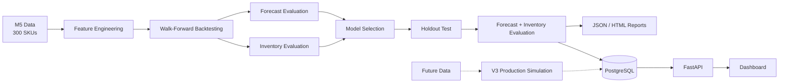

# Optimizing Retail Inventory & Demand Risk: A Walmart M5 Case Study

> **Core Business Questions**
>
> * How accurately can we forecast 28-day demand for a curated set of 300 SKUs with different sales-volume and activity patterns?
> * How can temporal forecast errors be translated into practical safety-stock and replenishment decisions?
> * Which forecasting approach provides a useful balance between predictive accuracy and downstream inventory performance?

This project uses Walmart's **M5 Forecasting** dataset from store `CA_1` to evaluate machine-learning forecasts against operational baselines and connect forecast performance to inventory decisions.

The system covers centralized feature engineering, recursive and direct forecasting, walk-forward validation, automated experiment comparison, error-based replenishment simulation, PostgreSQL persistence, and FastAPI serving.

---

## Dataset Scope

* **300 curated SKUs** from the `FOODS`, `HOBBIES`, and `HOUSEHOLD` departments.
* SKUs are stratified by revenue and sales frequency to cover different demand-volume and activity patterns.
* All 300 SKUs have a complete three-year training history and continue into the evaluation period.
* The full-history design avoids missing-SKU issues in out-of-sample forecast and inventory evaluation.

**Current limitation:** the benchmark does not yet evaluate cold starts, partial histories, late product launches, or product exits. The remaining future data is reserved for the v3 production-style simulation.


---

## Architecture



---

## Forecasting Pipeline

### Centralized feature engineering

All model features are created through a central feature-engineering class before training.

Features include:

* Demand lags
* Rolling statistics
* Calendar variables
* Events and SNAP indicators
* Price information
* Trend features
* SKU-level information

Feature construction is designed to preserve temporal causality. Features used at a forecast origin are derived only from information available at that point, with recursive predictions used where required.

### Forecasting approaches

**Recursive LightGBM**

Predicts one day at a time. Each prediction becomes available as an input when generating subsequent forecasts, allowing lag and rolling features to evolve through the forecast horizon.

**Direct LightGBM**

Trains the forecasting problem across the 28-day horizon so that each future horizon is predicted without feeding previous model predictions back into the feature set.

**Operational baselines**

* Seasonal naive
* Trailing moving average

The baselines provide reference points for both forecast accuracy and downstream inventory performance.

---

## Validation & Model Selection

The pipeline uses **chronological walk-forward backtesting** rather than random train/test splitting.

Backtesting experiments can be configured and compared automatically. A selected model can then be evaluated on a separate holdout test period against the same baselines.

This separates:

1. **Model experimentation** — compare forecasting approaches across historical backtest windows.
2. **Model selection** — select a candidate based on the experiment results.
3. **Holdout evaluation** — evaluate the selected candidate on unseen data.
4. **Deployment decision** — determine whether the candidate provides sufficient evidence to justify deployment.

A model winning historical backtests does not automatically imply that it should be deployed. The holdout evaluation and comparison with stronger baselines remain separate checks.

---

## Evaluation

### Forecast metrics

* **WRMSSE** — primary forecast-accuracy metric
* **MAE** — interpretable absolute error
* **Bias** — systematic over- or under-forecasting
* **Cumulative forecast error**
* **Forecast Value Added (FVA)** relative to operational baselines

### Inventory metrics

The forecasting evaluation is complemented by a periodic-review inventory simulation using:

* Lead time
* Review period
* Forecasted demand over the risk period
* Error-based safety stock
* Order-up-to levels
* Holding cost
* Stockout cost
* Lost sales

Forecast accuracy and inventory performance are treated as related but distinct evaluation layers.

---

## Current Reference Result

## Holdout Test Result

After thorough walk-forward backtesting and model selection, the selected candidate was evaluated on a separate unseen holdout period.

**Current deployment candidate: LGBM Direct**

| Metric | LGBM Direct |
|---|---:|
| MAE | **1.0816** |
| BIAS% | **-3.14%** |
| WRMSSE | **0.8302** |
| Cumulative MAE | **5.3905** |
| Cumulative Bias | **-0.4042** |
| Average total inventory cost | **$3,830.00** |

### Business impact

| Comparison | Cost Difference | FVA |
|---|---:|---:|
| Moving Average | **$614.88 lower** | **13.83%** |
| Seasonal Naive | **$534.93 lower** | **12.26%** |

The holdout therefore provides the current evidence used for the deployment decision. It should not be interpreted as a guarantee of future production performance.

## Inventory Simulation

The inventory component uses a **periodic-review replenishment policy**.

At each review point, the system calculates the inventory decision using the forecast and current inventory state:

```text
Forecast
   ↓
Risk-period demand
   ↓
Safety stock
   ↓
Order-up-to level
   ↓
Order quantity
```

The current test simulation generates inventory decisions for the complete evaluation month at each review period and records realized inventory outcomes.

In a future production-style simulation, the process will operate sequentially:

```text
Review date
    ↓
Generate forecast
    ↓
Generate replenishment order
    ↓
Store decision in PostgreSQL
    ↓
Demand occurs
    ↓
Actual sales / lost sales become available
    ↓
Update realized inventory outcomes
    ↓
Next review period
```

This allows the same inventory database structure to support both retrospective testing and a future production-like replay.

---

## Database & API

**PostgreSQL** stores forecast and inventory results used by the application and dashboard.

The database currently supports:

* Forecast results
* Inventory decisions
* Inventory state
* Replenishment quantities
* Safety-stock levels
* Realized inventory costs

Realized outcomes such as lost sales and costs can be populated after the corresponding demand period has elapsed.


## FastAPI Serving

The current FastAPI service exposes pre-computed forecast and inventory results persisted in PostgreSQL.

### Forecast endpoint

```http
POST /forecast

## Dashboard

The dashboard provides a consolidated view of:

* Forecast performance
* Model/backtest comparisons
* Baseline comparisons
* Forecast bias and error
* Inventory performance
* Replenishment decisions
* Holding and stockout costs

The dashboard is intended to connect the forecasting layer with the downstream inventory decision rather than treating forecast accuracy as the only business outcome.

---

## Current Drawbacks

### Direct forecasting memory requirements

Direct multi-horizon training creates up to 28 forecast rows per historical origin. This substantially increases the training dataset and memory requirements.

With 300 SKUs, the current implementation is feasible on local hardware but becomes increasingly expensive as SKU coverage increases.

### Limited benchmark scale

The current benchmark intentionally uses 300 curated SKUs rather than the complete M5 panel. Scaling the same implementation beyond this scope will require more efficient feature construction, training, or forecasting infrastructure.

### Limited lifecycle coverage

The current benchmark assumes complete historical coverage for the selected SKUs. Cold starts, partial histories, product launches, and product exits remain outside the current evaluation.

---

## Future Work

### 1. Stronger forecasting baselines

Evaluate additional methods before making deployment decisions:

* Seasonal moving averages
* Exponential smoothing / ETS
* Croston and related intermittent-demand methods
* Other lightweight statistical benchmarks

### 2. Performance and scalability

* Evaluate MLForecast or an equivalent optimized forecasting implementation
* Reduce direct-model training memory requirements
* Improve feature-generation efficiency
* Extend the pipeline beyond the current 300-SKU benchmark

### 3. Richer SKU information

Investigate:

* Product and category attributes
* Price sensitivity
* Promotion response
* Lifecycle stage
* Intermittency
* Seasonality
* Shared effects across related SKUs

### 4. V3 production-style simulation

Use the remaining future data to replay the forecasting and inventory process sequentially:

* Generate forecasts only from information available at each point in time
* Generate replenishment orders at review periods
* Simulate arrivals and inventory evolution
* Calculate realized sales and lost sales after demand occurs
* Accumulate inventory costs over time
* Evaluate partial-history and cold-start scenarios

---

## Running the Pipeline

From the workspace containing this README:

```bash
cd retail-forecast-system
uv sync
```

### Walk-forward backtest

```bash
uv run python run_pipeline.py \
    --mode backtest \
    --model lgbm \
    --forecast-type direct \
    --backtest-windows 5
```

### Holdout test

```bash
uv run python run_pipeline.py \
    --mode test \
    --model lgbm \
    --forecast-type direct
```

---

## Primary Evaluation Principle

**WRMSSE is the primary forecast-accuracy metric**, complemented by MAE, bias, FVA, and downstream inventory measures.

The project treats forecasting as the first stage of a broader decision pipeline:

```text
Demand data
    ↓
Feature engineering
    ↓
Forecast
    ↓
Forecast evaluation
    ↓
Inventory policy
    ↓
Replenishment decision
    ↓
Realized inventory outcomes
```

The objective is therefore not simply to produce a lower forecast error, but to understand how forecast quality and uncertainty translate into operational replenishment decisions.

