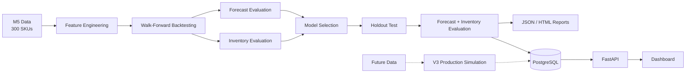

# Optimizing Retail Inventory & Demand Risk: A Walmart M5 Case Study

> **Core Business Questions**
>
> * How accurately can we forecast 28-day demand for a curated set of 300 SKUs with different sales-volume and activity patterns?
> * How can temporal forecast errors be translated into practical safety-stock and replenishment decisions?
> * Which forecasting approach provides a useful balance between predictive accuracy and downstream inventory performance?

This project uses Walmart's **M5 Forecasting** dataset from store `CA_1` to evaluate machine-learning forecasts against operational baselines and connect forecast performance to inventory decisions.

The system covers centralized feature engineering, recursive and direct forecasting, walk-forward validation, automated experiment comparison, error-based replenishment simulation, PostgreSQL persistence, and FastAPI serving.

---

## Dataset Scope

* **300 curated SKUs** from the `FOODS`, `HOBBIES`, and `HOUSEHOLD` departments.
* SKUs are stratified by revenue and sales frequency to cover different demand-volume and activity patterns.
* All 300 SKUs have a complete three-year training history and continue into the evaluation period.
* The full-history design avoids missing-SKU issues in out-of-sample forecast and inventory evaluation.

**Current limitation:** the benchmark does not yet evaluate cold starts, partial histories, late product launches, or product exits. The remaining future data is reserved for the v3 production-style simulation.


---

## Architecture



---

## Forecasting Pipeline

### Centralized feature engineering

All model features are created through a central feature-engineering class before training.

Features include:

* Demand lags (strictly done on t-1 to avoid leakage)
* Rolling statistics
* Calendar variables
* Events and SNAP indicators
* Price information
* Trend features
* SKU-level information

Feature construction is designed to preserve temporal causality. Features used at a forecast origin are derived only from information available at that point, with recursive predictions used where required.

### Forecasting approaches

**Recursive LightGBM**

Predicts one day at a time. Each prediction becomes available as an input when generating subsequent forecasts, allowing lag and rolling features to evolve through the forecast horizon.

**Multi-Horizon Direct LightGBM**

Trains the forecasting problem across the 28-day horizon so that each future horizon is predicted without feeding previous model predictions back into the feature set. Used a 7 day stride to create origin dates to reduce the computational bottleneck.

**Operational baselines**

* Seasonal naive
* Trailing moving average
* Seasonal Moving Average (More stronger baseline)
* Croston & Croston SBA (since data contains extremely intermittent SKUs. But found out to be least performing since the parameters are driven by smooth SKUs)

The baselines provide reference points for both forecast accuracy and downstream inventory performance.

---

## Validation & Model Selection

The pipeline uses **chronological walk-forward backtesting** rather than random train/test splitting.

Backtesting experiments can be configured and compared automatically. A selected model can then be evaluated on a separate holdout test period against the same baselines.

This separates:

1. **Model experimentation** — compare forecasting approaches across historical backtest windows.
2. **Model selection** — select a candidate based on the experiment results.
3. **Holdout evaluation** — evaluate the selected candidate on unseen data.
4. **Deployment decision** — determine whether the candidate provides sufficient evidence to justify deployment.

A model winning historical backtests does not automatically imply that it should be deployed. The holdout evaluation and comparison with stronger baselines remain separate checks.

---

## Evaluation

### Forecast metrics

* **WRMSSE** — primary forecast-accuracy metric
* **WAPE**   - 
* **MAE** — interpretable absolute error 
* **Bias** — systematic over- or under-forecasting
* **Cumulative forecast error** and **Cumulative bias** : over the risk period
* **Forecast Value Added (FVA)** relative to operational baselines

### Inventory metrics

The forecasting evaluation is complemented by a periodic-review inventory simulation using:
This layer is fixed and not optimized with different policies. 
* Lead time (fixed)
* Review period (fixed)
* Forecasted demand over the risk period
* Error-based safety stock 
* Order-up-to levels
* Holding cost
* Stockout cost
* Lost sales

Forecast accuracy and inventory performance are treated as related but distinct evaluation layers.

---

## Current Reference Result

## Holdout Test Result

After thorough walk-forward backtesting and model selection, the selected candidate was evaluated on a separate unseen holdout period.

**Current deployment candidate: LGBM Direct**

| Metric | LGBM Direct |
|---|---:|
| MAE | **1.0880** |
| BIAS% | **-2.61%** |
| WRMSSE | **0.8435** |
| Cumulative MAE | **5.4316** |
| Cumulative Bias | **-0.336** |
| Total inventory cost | **$16,479** |

### Business impact
Cost Savings with Other Models:

Total costs in this portfolio are predominantly driven by inventory holding expenses rather than stockouts—even under balanced cost parameters (**holding cost per unit = 0.2; stockout penalty factor = 1.0**). This stems from the complexity of predicting demand across highly diverse SKUs with a pronounced long tail. Across both statistical baselines and advanced machine learning models, algorithms consistently exhibit an upward forecasting bias when attempting to capture sparse long-tail demand.

| Comparison | Cost Difference | FVA |
|---|---:|---:|
| Moving Average | **$1136 lower** | **6.45%** |
| Seasonal Moving Average | **$1601 lower** | **8.86%**|
| Seasonal Naive | **$2144 lower** | **11.52%** |
| Croston SBA | **$2220 lower** | **11.88%** |
| Croston | **$3085 lower** | **15.77%** |

The holdout therefore provides the current evidence used for the deployment decision. It should not be interpreted as a guarantee of future production performance.

## Inventory Simulation

The inventory component uses a **periodic-review replenishment policy**.
* **Note**: The current policy applies standardized holding and stockout costs across all SKUs to determine safety stock levels. A key outcome of this analysis reveals that adopting segment-specific inventory policies—particularly specialized strategies for long-tail and intermittent items—will unlock further high-impact cost savings beyond the baseline projections.
At each review point, the system calculates the inventory decision using the forecast and current inventory state:

```text
Forecast
   ↓
Risk-period demand
   ↓
Safety stock
   ↓
Order-up-to level
   ↓
Order quantity
```

The current test simulation generates inventory decisions for the complete evaluation month at each review period and records realized inventory outcomes.

In a future production-style simulation, the process will operate sequentially:

```text
Review date
    ↓
Generate forecast
    ↓
Generate replenishment order
    ↓
Store decision in PostgreSQL
    ↓
Demand occurs
    ↓
Actual sales / lost sales become available
    ↓
Update realized inventory outcomes
    ↓
Next review period
```

This allows the same inventory database structure to support both retrospective testing and a future production-like replay.

---

## Database & API

**PostgreSQL** stores forecast and inventory results used by the application and dashboard.

The database currently supports:

* Forecast results
* Inventory decisions
* Inventory state
* Replenishment quantities
* Safety-stock levels
* Realized inventory costs

Realized outcomes such as lost sales and costs can be populated after the corresponding demand period has elapsed.


## FastAPI Serving

The current FastAPI service exposes pre-computed forecast and inventory results persisted in PostgreSQL.

### Forecast endpoint

```http
POST /forecast
```

The FastAPI service retrieves pre-computed forecasts and inventory information from PostgreSQL for a requested `store_id` and `item_id`.

The endpoint returns:

* 28-day demand forecasts
* Prediction dates
* Quantile forecasts (`q10`, `q90`)
* Safety stock
* Reorder point
* Order-up-to level

The API currently serves persisted results; model training and forecast generation are performed separately by the forecasting pipeline.

# Diagnostic Findings, System Limitations & Roadmap

## Key Diagnostic Finding
Holding costs account for ~97% of total portfolio cost because standard ML models over-forecast sparse long-tail demand, and summing daily 85th-percentile quantiles across the review window severely inflates safety stock.

---

## Future Roadmap & Strategic Next Steps

* **Direct Horizon Forecasting:** Transition from daily point predictions to forecasting cumulative demand over the full risk horizon ($L+R$). Using a sliding window preserves sample size while smoothing zero-inflation and outputting exact Reorder Points (ROP) via direct quantile regression.
* **Differentiated Inventory Policies:** Move away from uniform safety stock rules by implementing specialized intermittent strategies (e.g., Croston SBA or Min-Max ROP triggers) for slow movers, reserving ML point forecasts for high-velocity SKUs.
* **Pipeline Generalization:** Decouple hardcoded M5 column references into a centralized schema config to make the end-to-end framework portable across arbitrary retail datasets.

---

## System Limitations

* **Scale & Memory:** Direct multi-horizon target generation increases dataset size per historical origin. While efficient for 300 SKUs, scaling requires optimized feature pipelines and memory management.
* **Scope:** The benchmark currently assumes full historical coverage and does not evaluate cold starts, product launches, or SKU exits.

---

### V3 production-style simulation

Use the remaining future data to replay the forecasting and inventory process sequentially:

## Running the Pipeline

From the workspace containing this README:

```bash
cd retail-forecast-system
uv sync
```

### Walk-forward backtest

```bash
uv run python run_pipeline.py \
    --mode backtest \
    --model lgbm \
    --forecast-type direct \
    --backtest-windows 5
```

### Holdout test

```bash
uv run python run_pipeline.py \
    --mode test \
    --model lgbm \
    --forecast-type direct
```

---

## Primary Evaluation Principle

**WRMSSE is the primary forecast-accuracy metric**, complemented by WAPE, cumulative MAE and BIAS, FVA, and downstream inventory measures.

The project treats forecasting as the first stage of a broader decision pipeline:

```text
Demand data
    ↓
Feature engineering
    ↓
Forecast
    ↓
Forecast evaluation
    ↓
Inventory policy
    ↓
Replenishment decision
    ↓
Realized inventory outcomes
```

The objective is therefore not simply to produce a lower forecast error, but to understand how forecast quality and uncertainty translate into operational replenishment decisions.

